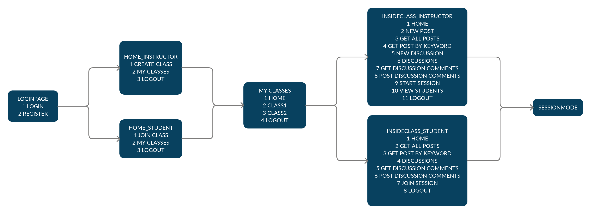

## To Run the project
cd to the directory which has the server.py and client.py
Terminal 1: python3 server.py
Terminal 2: python3 client.py
Terminal 2 will then show instructions to proceed.

## Client and Server side logic
Client connects to the server and sends a GETLOGINPAGE command to get the LOGINPAGE. The server responds with a list of available commands. Then the TCP connection is closed.
 
For each subsequent command the client sends one of the available commands (and the parameters required for its execution) to the server using a new TCP connection. Then the server authenticates the client, saves the client's state and responds with a message and a list of available commands.

 

## State Management
Client States are saved in onlineUsers db table in server.
 
onlineUsers table has 3 columns (username, usertype, clientstate); clientstate is a dict() with keys: ["loc", "cmd_list", "classid"]. 
"loc": stores the name of current state/location (eg. LOGINPAGE) 
"cmd_list": stores a list of commands available at "loc" 
"classid": stores the id of current class. Only needed in INSIDECLASS locations. For other locations its value is -1. 
On LOGOUT command from client the entry in onlineUsers corrosponding to the current user is removed.
 
The Client program has no states. First time it sends a command "GETLOGINPAGE", then the server reponds with the commands available in LOGINPAGE. Everytime the client sends a command to the server, the server responds with a message and a list of available commands.

 

## Commands and Actions Management
Clients can only use the commands made available by the server. The server manages and executes the actions of each command after it has authenticated the user and checked if the command is available to the user.

## Security Aspects
Everytime the client connects to the server for accessing a feature or execution of a command, the server first authenticates the client and then proceeds with the execution.
For multithreading, locks are held when writing to database tables.